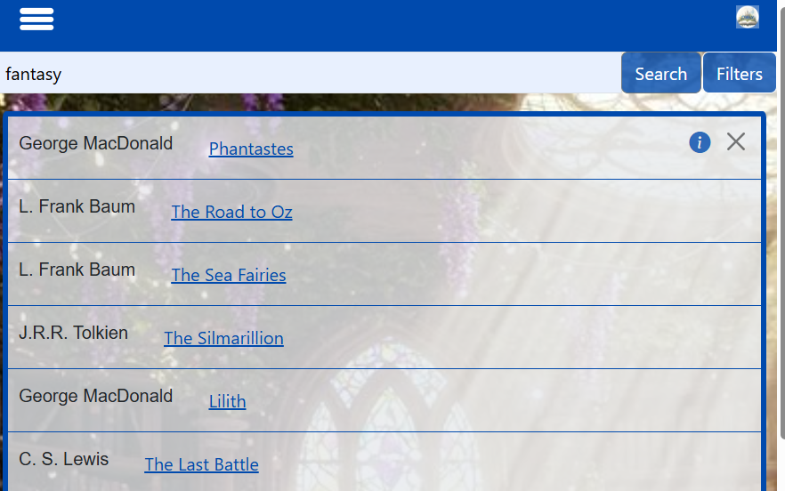
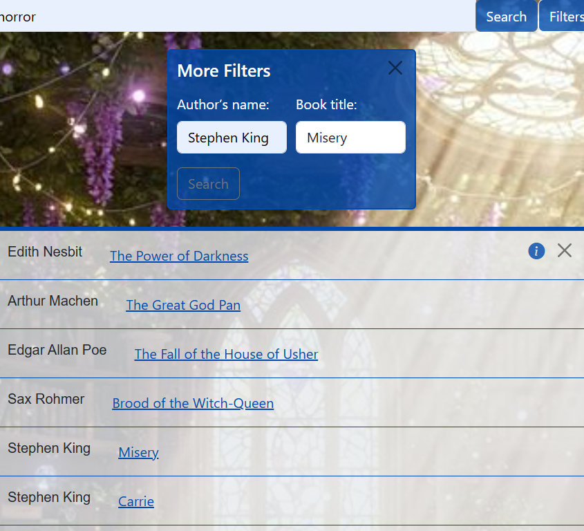

# OwlyApplicationChiaraGiada

Owly is an educational platform designed to support primary schools and families. Its main purpose is to provide an easy way to search for educational books included in the school curriculum. This project was developed with a focus on usability, accessibility, and modern front-end architecture.

## Purpose
The platform aims to:

- Help children and parents find educational books for primary school.
  
- Provide a user-friendly interface to browse and search books.
  
- Support families in choosing appropriate educational resources.

Owly is ideal for teachers, students, and parents who want a centralized platform for educational content.

## How to Run Locally
To run Owly on your local machine using Git
npm install
npm run build
npm start

## Clone the repository

git clone https://github.com/your-username/OwlyApplicationChiaraGiada.git

## using Live server to see it

## Technologies Used

The project was built using the following technologies:

- **JavaScript** – Core functionality and dynamic DOM manipulation.
- **Sass (SCSS)** – Advanced CSS preprocessor for structured and maintainable styles.
- **HTML5** – Semantic markup for accessibility and SEO.
- **Bootstrap** – Responsive design and pre-built UI components.
- **Webpack** – Module bundler to compile JS, SCSS, and manage assets.

##Project Structure

OwlyApplicationChiaraGiada/
├─ dist/                # Compiled output (JS bundles, HTML, assets)
├─ node_modules/
├─ src/
│  ├─ js/
│  │  ├─ logic.js
│  │  └─ search.js
│  ├─ style/
│  │  ├─ style.scss
│  │  └─ search.scss
│  ├─ index.html
│  └─ search.html
├─ package.json
├─ webpack.config.js
└─ README.md

## Info extra:
# First Page:

Presentation Owly 
- HAbout Us
- Services
- Contacts
  Presentation of Owly, including About Us, Services, and Contacts.

# Second Page:
-Find your book 
Basic search by category
Search by author or title
Extra filters for advanced search

Results display similar or matching books
basic serach only for category 

 authour and title
 
Extra filter for a deeper serach 

Same result or similar books

# TO OPEN APP ONLINE 
## Prova l'app online
[open Owly Application online](https://GiadaChiar.github.io/OwlyApplicationChiaraGiada/)

